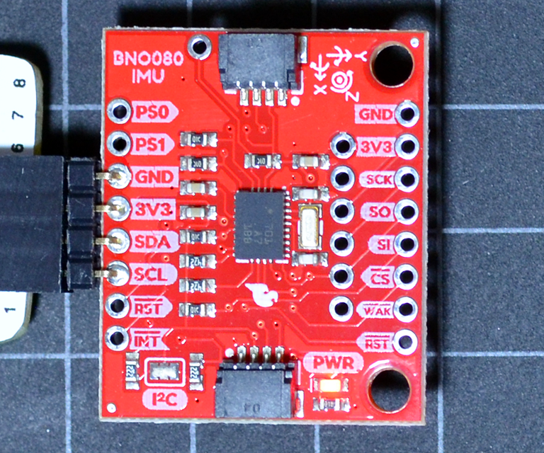

# Pi-BNO080

## Background

This is a C driver program for operating a HillCrest Labs (Bosch) BNO080 IMU sensor via I2C on a Raspberry Pi. Compared to the BNO055, the BNO080 has a improved accuracy and more features through Hillcrest Labs SH2 firmware, promises higher fusion sampling rate up to 400Hz (BNO055: 100Hz). In the BNO080, the accelerometer resolution has been reduced to 12-bit (BNO055: 14-bit).



### Note

This is a early work fragment and not a completed project. The SHTP protocol running over I2C requires more analysis / work on the asynchronous communication model. I abandoned this project but keep it online as a starting point for others. 

## I2C bus connection

On the Raspberry Pi I2C bus, the Sparkfun sensor board has I2C protcol as the default, and it responds  on the I2C bus with the slave address 0x4b. Per BNO080 datasheet, two I2C addresses are possible: 0x4a or 0x4b, depending on the SA0 pin level. Sparkfun by default pulls the SA0 pin up. If jumper SJ2 gets closed, SA0 will be pulled down and sets the address 0x4a.

```
root@pi-ws01:/home/pi# i2cdetect -y 1
     0  1  2  3  4  5  6  7  8  9  a  b  c  d  e  f
00:          -- -- -- -- -- -- -- -- -- -- -- -- --
10: -- -- -- -- -- -- -- -- -- -- -- -- -- -- -- --
20: -- -- -- -- -- -- -- -- -- -- -- -- -- -- -- --
30: -- -- -- -- -- -- -- -- -- -- -- -- -- -- -- --
40: -- -- -- -- -- -- -- -- -- -- -- 4b -- -- -- --
50: -- -- -- -- -- -- -- -- -- -- -- -- -- -- -- --
60: -- -- -- -- -- -- -- -- -- -- -- -- -- -- -- --
70: -- -- -- -- -- -- -- --
```

## Sensor communication protocol

Unlike the BNO055 sensor from Bosch, the BNO080 is using the Hillcrest Labs own communication protocol SHTP (Sensor Hub Transport Protocol). Hillcrest Labs provides a Open-Source sensor hub driver API reference implementation in github (licensed under Apache 2.0), implemented with STM32 MCU. I found the Arduino driver for BNO080 easier to understand.

## Code compilation

Compiling the program:
````
pi@nanopi-neo2:~/pi-bno080 $ make
cc -O3 -Wall -g   -c -o i2c_bno080.o i2c_bno080.c
cc -O3 -Wall -g   -c -o getbno080.o getbno080.c
cc i2c_bno080.o getbno080.o -o getbno080
````

## Example output

Retrieving sensor information:
```
pi@nanopi-neo2:~/pi-bno080 $ ./getbno080 -a 0x4b -t inf
Test 0 data-0 248
Debug: CMD reportID [F1] REPseq [00] CMD [07] CMDseq [01] RESPseq [00] R0 [00]

BNO080 Information at Sat Apr  6 09:04:54 2019
----------------------------------------------
Part 10003608 : Version 3.2.7 Build 370 Last Reset: Internal System Reset
Part 10003606 : Version 1.2.4 Build 230 Last Reset: Not Applicable
Calib. ON/OFF : ACC=ON GYRO=OFF MAG=ON PLANAR-ACC=OFF
SHTP Errors # : 0 entries
Sensor Serial : [0.000000]
```

Resetting the sensor (verbose):
```
pi@nanopi-neo2:~/pi-bno080 $ ./getbno080 -r -v
Debug: ts=[1549718531] date=Sat Feb  9 22:22:11 2019
Debug: Sensor I2C address: [0x4B]
Debug: Sending 6 bytes, Header [06] [00] [00] [01] Data [01] [00]
Debug: Receiving 6 bytes, Header [06] [80] [00] [0B] ST [0] Data [01] [02]
Debug: SHTP error list received, data [02]
Debug: Sending 5 bytes, Header [05] [00] [01] [01] Data [01]
Debug: Receiving 276 bytes, Header [14] [81] [00] [01] ST [0] Data [00] [01] [04] [00] [00] [00] [00] [80] [06] [31] [2E] [30] [2E] [30] [00] [02] [02] [00] [01] [03] [02] [FF] [7F] [04] [02] [00] [01] [05] [02] [FF] [7F] [08] [05] [53] [48] [54] [50] [00] [06] [01] [00] [09] [08] [63] [6F] [6E] [74] [72] [6F] [6C] [00] [01] [04] [01] [00] [00] [00] [08] [0B] [65] [78] [65] [63] [75] [74] [61] [62] [6C] [65] [00] [06] [01] [01] [09] [07] [64] [65] [76] [69] [63] [65] [00] [01] [04] [02] [00] [00] [00] [08] [0A] [73] [65] [6E] [73] [6F] [72] [68] [75] [62] [00] [06] [01] [02] [09] [08] [63] [6F] [6E] [74] [72] [6F] [6C] [00] [06] [01] [03] [09] [0C] [69] [6E] [70] [75] [74] [4E] [6F] [72] [6D] [61] [6C] [00] [07] [01] [04] [09] [0A] [69] [6E] [70] [75] [74] [57] [61] [6B] [65] [00] [06] [01] [05] [09] [0C] [69] [6E] [70] [75] [74] [47] [79] [72] [6F] [52] [76] [00] [80] [06] [31] [2E] [31] [2E] [30] [00] [81] [64] [F8] [10] [F5] [04] [F3] [10] [F1] [10] [FB] [05] [FA] [05] [FC] [11] [EF] [02] [01] [0A] [02] [0A] [03] [0A] [04] [0A] [05] [0E] [06] [0A] [07] [10] [08] [0C] [09] [0E] [0A] [08] [0B] [08] [0C] [06] [0D] [06] [0E] [06] [0F] [10] [10] [05] [11] [0C] [12] [06] [13] [06] [14] [10] [15] [10] [16] [10] [17] [00] [18] [08] [19] [06] [1A] [00] [1B] [00] [1C] [06] [1D] [00] [1E] [10] [1F] [00] [20] [00] [21] [00] [22] [00] [23] [00] [24] [00] [25] [00] [26] [00] [27] [00] [28] [0E] [29] [0C] [2A] [0E]
Debug: Receiving 5 bytes, Header [05] [80] [01] [01] ST [0] Data [01]
Debug: Receiving 20 bytes, Header [14] [80] [02] [01] ST [0] Data [F1] [00] [84] [00] [00] [00] [01] [00] [00] [00] [00] [00] [00] [00] [00] [00]
Debug: Sending 5 bytes, Header [05] [00] [00] [02] Data [01]
Debug: Receiving 5 bytes, Header [05] [80] [00] [03] ST [0] Data [01]
Debug: Reset complete
```
